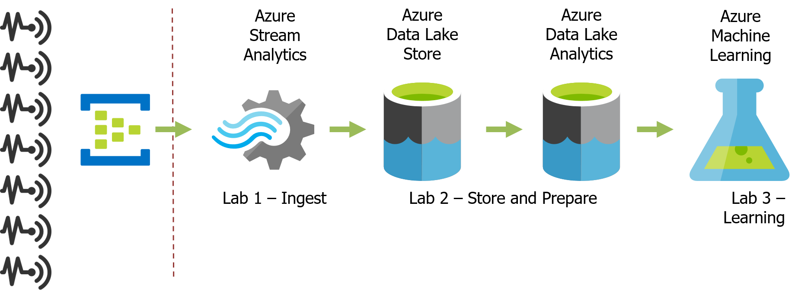

# Hands on Labs Global Azure Bootcamp 2017
## Vianen, April 22, 2017

For the [Global Azure Bootcamp 2017](https://global.azurebootcamp.net/) [Rubicon](http://rubicon.nl/) organized an event with [Cortana Intelligence Suite (CIS)](http://www.microsoft.com/en-us/cloud-platform/cortana-intelligence-suite) as theme. These HOLs are created and provided that day by [Jan Pieter Posthuma](https://linkedin.com/in/jpposthuma) of [DataScenarios [NL]](https://datascenarios.nl)

For this hands-on-lab bootcamp three parts of CIS are beeing used and connected:

1. [Azure Stream Analytics](https://azure.microsoft.com/en-us/services/stream-analytics/)
2. [Azure Data Lake](https://azure.microsoft.com/en-us/services/data-lake-store/)
3. [Azure Machine Learning](https://azure.microsoft.com/en-us/services/machine-learning/)

### Prerequisites

See the [prerequisites](Prerequisites.md) document for the full list.

### Scenario

These HOL examples are part of a total data scenario. For this event, the sensor data and event hub (left part) part of the scenario is provided.

#### Lab 1 - Ingest
When connection data from the Event Hub to Azure Stream Analytics (ASA) it is possible to process that data stream directly and 'query' to either determine outliers of to reroute the data stream.

[More info](AzureStreamAnalytics/README.md)

#### Lab 2 - Store and prepare
The rerouted data from Azure Stream Analytics (ASA) can be stored at an Azure Data Lake Store (ADLS) directly in a folder.

After storing the raw data, it is possible to extract information from it by utilizing Azure Data Lake Analytics (ADLA). With U-SQL it is possible to read individual files (JSON) and extract information within one query.

[More info](AzureDataLake/README.md)

#### Lab 3 - Learning
The result of lab 2 will be used to start learning from the data. By using Azure Machine Learning (AzureML) it is possible to create a ML model that identifies incorrect events and even faulty sensors.

[More info](AzureMachineLearning/README.md)

#### Extra - Close the loop
It is possible to connect an AzureML model to an Azure Stream Analytics Job and use the outcome of that model to predict the incoming events.

[More info](CloseTheLoop/README.md)

---
[License](../LICENSE)